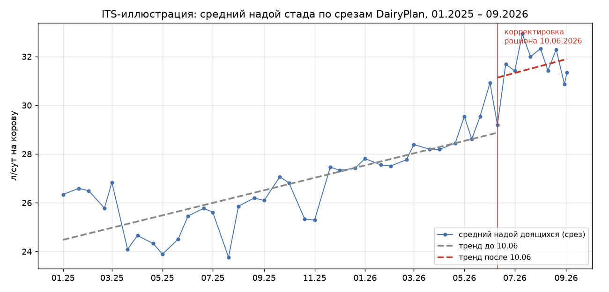
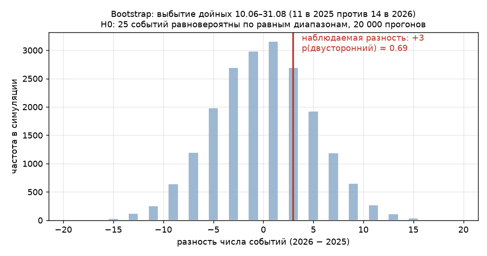
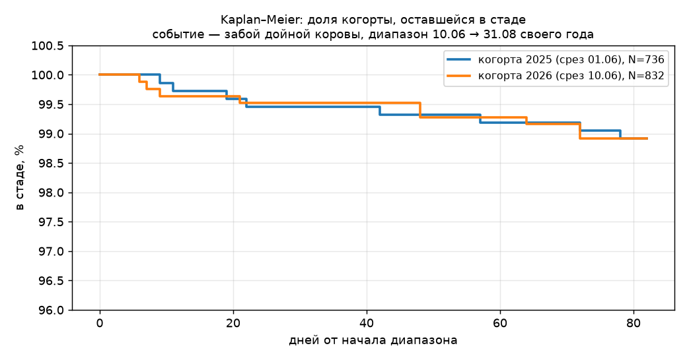

# Статистические методы для технологических отчётов: дорожная карта внедрения

> Рабочая заметка (личный интерес пилота, 2026-09-09). К CASE-002 относится как «следующий уровень строгости» — не часть принятого отчёта.

## Как это внедрить постепенно

**1. Начни с LMM — это даст максимальную отдачу при минимальном пороге входа.**
Замени парный t-тест на модель со случайным эффектом коровы и ковариатами. Почувствуешь разницу.

**2. Добавь ITS для визуализации всего периода, а не только двух точек.**
Это хорошо смотрится в отчётах и убедительно для руководства.

**3. Используй bootstrap для нестандартных показателей** (доли, малые выборки выбытия). Код простой.

**4. Погрузись в survival analysis для анализа выбытия и здоровья.**
Это отдельный пласт, но он очень востребован в молочном скотоводстве.

**5. Байесовские методы — по мере роста уверенности, для сложных решений.**

---

## Согласуется ли это с выводами отчёта CASE-002

**Короткий ответ: да, полностью. Дорожная карта не оспаривает ни одного вывода отчёта — она описывает, как те же выводы получать строже и с меньшими ручными оговорками. Два из пяти пунктов мы в CASE-002 фактически уже применили в зачаточном виде.**

По пунктам:

**LMM (линейная смешанная модель) — мы были в одном шаге от него.**
Наш парный анализ (741 корова, +2,4 кг, 95% ДИ +1,9…+2,8) — это по сути LMM с одним случайным эффектом коровы, но без ковариат. Что добавит полноценный LMM: ковариаты DIM, номера лактации, производственной группы — точечная оценка эффекта может чуть сместиться (вероятно, останется в том же коридоре +2…+3 кг), доверительный интервал станет честнее. Главный вывод («рост привязан к корректировке 10.06») LMM не перевернёт — он ответит на вопрос «кому именно досталось больше» (мы уже видим градиент: 0–10 дн +11 кг).

**ITS (прерванный временной ряд) — наш двойной различие (DiD) и есть его двухточечная версия.**
Мы сравнили «до/после» с контролем внутри стада и с прошлым годом — логика ITS, но только по двум точкам вокруг 10.06. Полноценный ITS использует весь ряд (у нас он есть: срезы каждые 10 дней с 01.2025) и разделяет скачок уровня и изменение наклона. Это добавило бы отчёту именно убедительную картинку «тренд сломался 10 июня», которую сейчас читатель должен разглядеть в графике глазами. На выводы не повлияет — плацебо-тест уже закрыл вопрос «не совпадение ли».

*Ряд из 46 срезов DairyPlan (01.2025–09.2026): тренд до 10.06 пологий (~+0,4 кг/мес), после — скачок уровня и более крутой наклон. Именно эту картину ITS превращает в оценку с интервалами.*

**Bootstrap — наш плацебо-тест из той же семьи.**
34 фиктивные даты за 21 месяц — это перестановочная проверка, родственная bootstrap по духу: «как часто такое случается само». Там, где мы писали «в пределах разброса» (выбытие 14 против 11), bootstrap дал бы число вместо качественной фразы — например, «p ≈ 0.6, различие не выходит за случайный разброс». Показания к применению в отчёте были именно там, где рекомендация и указывает: доли и малые выборки.

*Проверка на данных кейса: 25 событий (11 + 14) равновероятно делятся между равными диапазонами — наблюдаемая разность +3 глубоко внутри случайного распределения (p ≈ 0.69). Фраза «в пределах разброса» стала числом.*

**Survival analysis — единственный пласт, где мы сейчас на уровне «считаем головы».**
Приложение 2 (выбытие) оперирует частотами и медианой DIM. Модели Каплана–Майера и Кокса дали бы: кривые «дожития в стаде» до/после 10.06, риски по причинам (отдельно ТБС!), поправку на цензуру (коровы, ещё в стаде). Важно честно: при 14 событиях за диапазон силы такого анализа немного — вывод «выбытие не выросло» устоит. Реальная отдача — в мониторинге ТБС (наша рекомендация аудита) и в анализе падежа молодняка, где записей 171 и есть с чем работать.

*Кривые двух когорт (N=736 и N=832 доящихся) практически совпадают — визуальное подтверждение вывода «выбытие не выросло». Оговорка: для 2025 когорта по срезу 01.06 (среза 10.06.2025 нет).*

**Байесовские методы — закрыли бы наши «слепые зоны».**
Где мы вынуждены были написать «выводы не делаем» (группы 15, 19, 22 — малые и меняющиеся составы; кетоны — 5 коров), байесовская модель с разумным априором дала бы осторожную количественную оценку вместо отказа. Это элегантно, но именно «по мере роста уверенности»: окупается, когда таких слабых мест в отчётах станет заметно.

### Итоговая сверка

| Вывод отчёта | Подтверждается дорожной картой? |
|---|---|
| Рост +2,4 кг у парной когорты — следствие корректировки 10.06 | Да; LMM уточнит оценку, ITS покажет на всём ряду |
| Эффект не объясняется отёлами (18%) и сезоном | Да; ITS/ковариата DIM в LMM — та же проверка строже |
| Выбытие не выросло (14 vs 11, в пределах разброса) | Да; bootstrap/survival заменили бы «в пределах разброса» на число |
| Кетоны в допустимой зоне (5 коров, 3 замера) | Да; здесь как раз пригодился бы байесовский подход — вывод осторожный и без него |
| ТБС требуют аудита (14% причин) | Да; survival по причинам — прямой инструмент для этого мониторинга |

**Рекомендация по очереди подтверждается нашим опытом:** LMM действительно даст максимум отдачи первым — наш парный анализ уже держится на его логике, и переход почти безболезненный (та же когорта, те же данные, плюс ковариаты).

---

*Составлено: 2026-09-09, Kimi (вне сессии, по запросу пилота). Источник пунктов внедрения — текст пилота; сверка — по отчёту `Отчет_ЖК2_итоговый_полный_2026-09-08.md`.*
