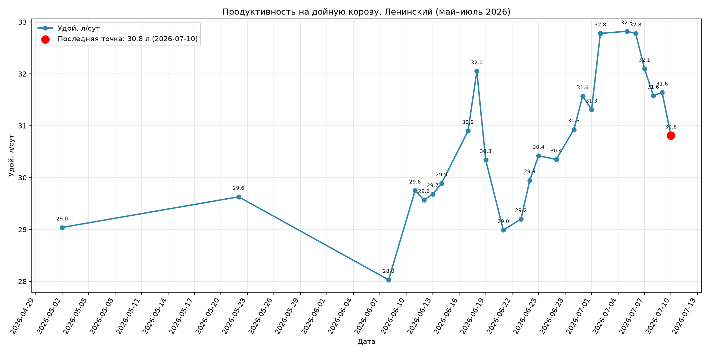
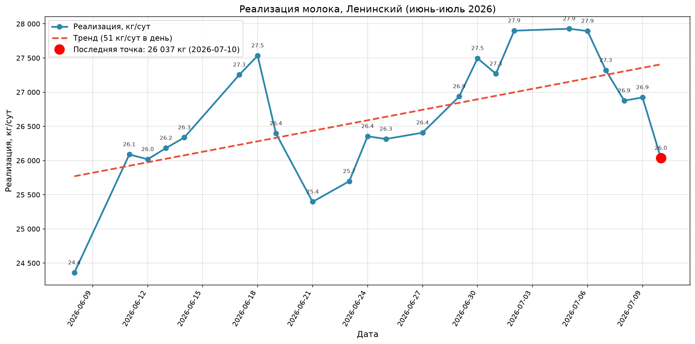
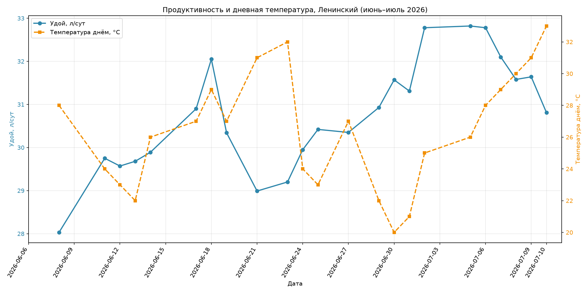
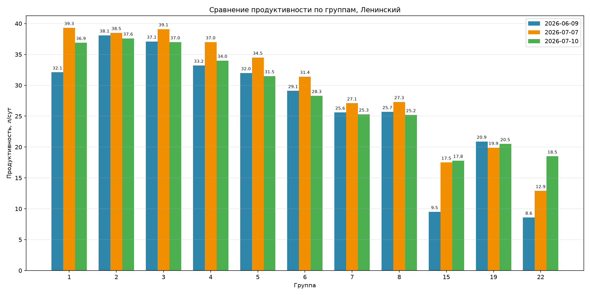

# Отчёт по производственным показателям Ж/К №2 Ленинский

**Период:** 08.06.2026 — 10.07.2026
**Дата отчёта:** 10.07.2026
**Объект:** Ж/К №2  Ленинский

---

## Резюме

- **Продуктивность выросла с 28,0 до 30,8 л/сут** — прирост **+2,8 л/сут** за отчётный период.
- **Реализация молока увеличилась с 24,4 до 26,0 тыс. кг/сут** — прирост **+1,7 тыс. кг/сут**.
- **Дойное поголовье снизилось:** с 869 до 845 голов (минимум 845, максимум 882).
- **Жирность молока стабильна:** 3,6–4,0%, на конец периода 3,9%.
- **В разрезе групп** продуктивность к 07.07 выросла в 10 из 11 групп (исключение — группа 19). К 10.07 на фоне жары (дневная температура +29…+33 °C) произошло закономерное снижение продуктивности в 9 из 11 групп.

---

## 1. Динамика производства

За отчётный период на Ж/К №2 зафиксирован общий рост продуктивности. Средний удой на корову составил **30,8 л/сут**, минимальный — 28,0 л/сут (08.06), максимальный — 32,8 л/сут (02–06.07).

| Показатель                                   | Начало периода | Конец периода | Изменение |
| ------------------------------------------------------ | --------------------------: | ------------------------: | -----------------: |
| Удой на корову, л/сут                  |                        28,0 |                      30,8 |     **+2,8** |
| Реализация молока, тыс. кг/сут |                        24,4 |                      26,0 |     **+1,7** |
| Дойные головы, гол.                     |                         869 |                       845 |               −24 |
| Жирность, %                                    |                         3,9 |                       3,9 |                0,0 |

*Рис. 1. Динамика удоя на корову и жирности молока на Ж/К №2 (2026-06-08 — 2026-07-10).*

*Рис. 2. Динамика реализации молока и дневной температуры на Ж/К №2 (2026-06-08 — 2026-07-10).*

*Рис. 3. Динамика удоя на корову и дневной температуры на Ж/К №2 (2026-06-08 — 2026-07-10).*

**Вывод:** тренд продуктивности восходящий. Пик удоя (32,8 л/сут) и реализации (27,9 тыс. кг/сут) пришёлся на 02–06.07. С 07.07 по 10.07 на фоне роста дневной температуры выше +28 °C зафиксировано снижение удоя до 30,8 л/сут и реализации до 26,0 тыс. кг/сут, что указывает на тепловой стресс.

---

## 2. Анализ продуктивности по группам

В разрезе групп 1–8 наблюдается типичная кривая лактации: максимальная продуктивность у групп с низким DIM (1–3), далее происходит плавное снижение по мере роста DIM. Группы 15 и 22 имеют аномальные сочетания DIM и продуктивности (DIM групп 15 и 22 меняется нелинейно между замерами), что указывает на переподгруппировку или особый статус этих групп.

### 2.1. Сравнение продуктивности групп на три даты

*Рис. 4. Сравнение продуктивности по группам на 09.06.2026, 07.07.2026 и 10.07.2026. Группа 9 исключена из отчёта, так как была добавлена только в последнем замере.*

### 2.2. Детализация по группам

| Группа | DIM 09.06 | Удой 09.06, л/сут | DIM 07.07 | Удой 07.07, л/сут | DIM 10.07 | Удой 10.07, л/сут | Изменение 09.06 → 07.07, л/сут | Изменение 07.07 → 10.07, л/сут |
| -----------: | --------: | ------------------------: | --------: | ------------------------: | --------: | ------------------------: | -------------------------------------------: | -------------------------------------------: |
|            1 |        20 |                      32,1 |        37 |                      39,3 |        35 |                      36,9 |                               **+7,2** |                                        −2,4 |
|            2 |        53 |                      38,1 |        63 |                      38,5 |        67 |                      37,6 |                                         +0,4 |                                        −0,9 |
|            3 |       104 |                      37,1 |        98 |                      39,1 |       101 |                      37,0 |                               **+2,0** |                                        −2,1 |
|            4 |       165 |                      33,2 |       163 |                      37,0 |       167 |                      34,0 |                               **+3,8** |                                        −3,0 |
|            5 |       211 |                      32,0 |       212 |                      34,5 |       218 |                      31,5 |                               **+2,5** |                                        −3,0 |
|            6 |       240 |                      29,1 |       249 |                      31,4 |       254 |                      28,3 |                               **+2,3** |                                        −3,1 |
|            7 |       308 |                      25,6 |       315 |                      27,1 |       315 |                      25,3 |                                         +1,5 |                                        −1,8 |
|            8 |       339 |                      25,7 |       326 |                      27,3 |       329 |                      25,2 |                                         +1,6 |                                        −2,1 |
|           15 |        25 |                       9,5 |       189 |                      17,5 |       183 |                      17,8 |                               **+8,0** |                                         +0,3 |
|           19 |       202 |                      20,9 |       216 |                      19,9 |       214 |                      20,5 |                                        −1,0 |                                         +0,6 |
|           22 |       358 |                       8,6 |       351 |                      12,9 |       353 |                      18,5 |                               **+4,3** |                               **+5,6** |

**Вывод:** к 07.07.2026 продуктивность выросла в 10 из 11 групп; снижение было только в группе 19 (−1,0 л/сут). К 10.07.2026 на фоне жары (дневная температура +29…+33 °C) произошло закономерное снижение продуктивности в 9 из 11 групп. Исключения — группы 15 (+0,3 л/сут) и 22 (+5,6 л/сут), где рост связан, вероятно, со структурными изменениями в группах, а не с реальным увеличением индивидуальной продуктивности.

### 2.3. Что это значит

К 07.07 Ж/К №2 вышел на хороший прирост: практически все основные группы прибавили в удое. Но к 10.07, после нескольких дней с температурой выше +28 °C, картина резко изменилась — 9 из 11 групп потеряли продуктивность. Больше всего молока теряют группы 4–6 (DIM 160–250): там много голов, и каждая десятая доля удоя чувствительна к жаре.

Группы 15 и 22 лучше не оценивать по этим цифрам: их DIM «прыгает» между замерами, значит состав группы менялся. Без проверки статуса эти данные могут ввести в заблуждение.

Главный итог: сейчас приоритет — не наращивать удой, а не дать жаре его «съесть», и уточнить, что происходит с группами 15 и 22.
