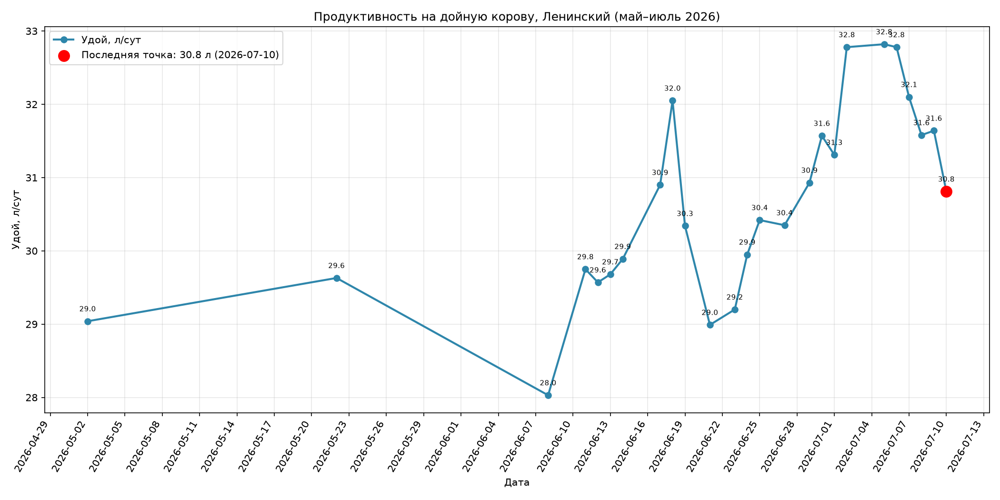
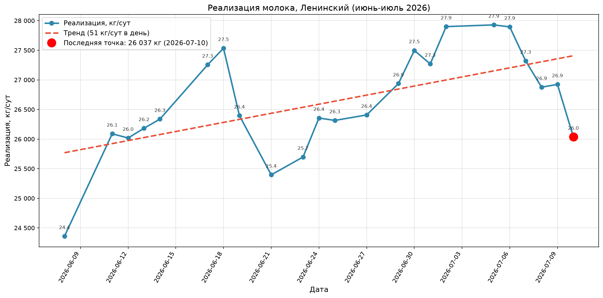
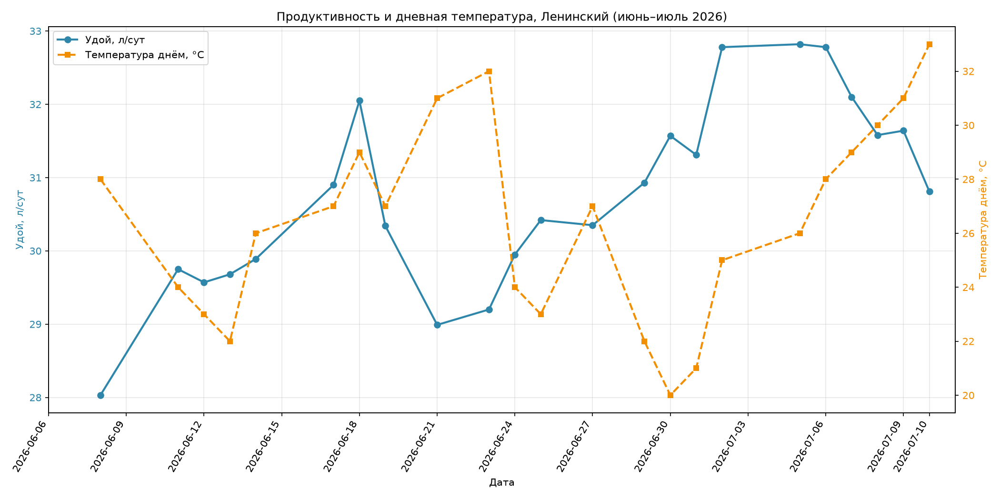
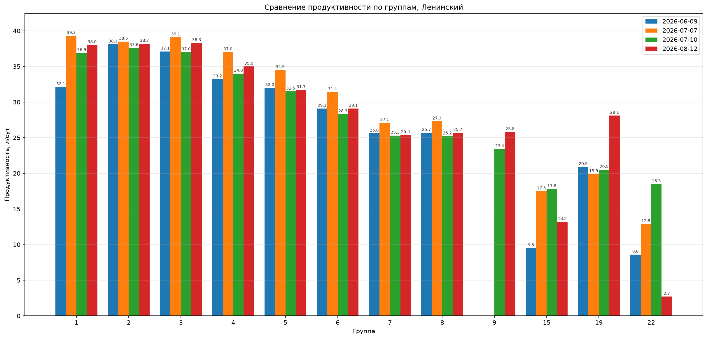

# Ж/К №2 за период прибавил +2,8 л/сут: рост в 10 из 11 групп, с 07.07 — снижение на фоне жары

**Период:** 08.06.2026 — 10.07.2026 · **Объект:** Ж/К №2 Ленинский · **Дата:** 10.07.2026

---

## Резюме

- **Удой на корову вырос с 28,0 до 30,8 л/сут (+2,8 л).** Пик — 32,8 л/сут на 02–06.07.
- **Реализация молока выросла с 24,4 до 26,0 тыс. кг/сут (+1,7 тыс. кг).** Пик — 27,9 тыс. кг/сут на 02–06.07.
- **Рост по группам широкий:** к 07.07 продуктивность увеличилась в 10 из 11 групп.
- **С 07.07 — снижение на фоне жары:** при дневной температуре +29…+33 °C удой за 3 дня снизился с 32,8 до 30,8 л/сут, продуктивность упала в 9 из 11 групп.
- **Поголовье и качество:** дойные головы сократились с 869 до 845 (−24); жирность стабильна — 3,9%.

## Динамика по комплексу в целом — положительная

За период удой на корову прибавил +2,8 л/сут, реализация — +1,7 тыс. кг/сут. Рост достигнут при сокращении поголовья на 24 головы, то есть за счёт продуктивности, а не числа коров. Максимальные значения периода зафиксированы на 02–06.07: 32,8 л/сут и 27,9 тыс. кг/сут реализации.

С 07.07 дневная температура поднялась выше +28 °C (+29…+33 °C), и за три дня удой снизился на 2,0 л/сут от пика, реализация — на 1,9 тыс. кг/сут. Снижение совпадает с периодом жары.

## Динамика по группам — рост в 10 из 11 групп к 07.07

К 07.07 продуктивность выросла в 10 из 11 групп. Наибольший прирост: группа 1 — +7,2 л/сут, группа 4 — +3,8, группа 5 — +2,5, группа 6 — +2,3, группа 3 — +2,0. Единственное снижение — группа 19 (−1,0 л/сут).

За 07.07–10.07, на фоне жары, продуктивность снизилась в 9 из 11 групп. Наибольшее снижение — в группах 4–6 (DIM 160–250): по −3,0…−3,1 л/сут. Группы 15 (+0,3) и 22 (+5,6) показали рост, однако их данные недостоверны: DIM этих групп меняется нелинейно между замерами (группа 15: 25 → 189 дней), что указывает на изменение состава групп, а не на реальную динамику продуктивности.

Группы 1–8 показывают типичную кривую лактации: максимальная продуктивность у групп с низким DIM, плавное снижение по мере его роста.

---

## Данные

### Общие показатели

| Показатель | Начало периода | Конец периода | Изменение |
|---|---:|---:|---:|
| Удой на корову, л/сут | 28,0 | 30,8 | **+2,8** |
| Реализация молока, тыс. кг/сут | 24,4 | 26,0 | **+1,7** |
| Дойные головы, гол. | 869 | 845 | −24 |
| Жирность, % | 3,9 | 3,9 | 0,0 |

*Рис. 1. Динамика удоя на корову и жирности молока на Ж/К №2 (2026-06-08 — 2026-07-10).*

*Рис. 2. Динамика реализации молока и дневной температуры на Ж/К №2 (2026-06-08 — 2026-07-10).*

*Рис. 3. Динамика удоя на корову и дневной температуры на Ж/К №2 (2026-06-08 — 2026-07-10).*

### Продуктивность по группам

| Группа | DIM 09.06 | Удой 09.06, л/сут | DIM 07.07 | Удой 07.07, л/сут | DIM 10.07 | Удой 10.07, л/сут | Изм. 09.06→07.07 | Изм. 07.07→10.07 |
|---:|---:|---:|---:|---:|---:|---:|---:|---:|
| 1 | 20 | 32,1 | 37 | 39,3 | 35 | 36,9 | **+7,2** | −2,4 |
| 2 | 53 | 38,1 | 63 | 38,5 | 67 | 37,6 | +0,4 | −0,9 |
| 3 | 104 | 37,1 | 98 | 39,1 | 101 | 37,0 | **+2,0** | −2,1 |
| 4 | 165 | 33,2 | 163 | 37,0 | 167 | 34,0 | **+3,8** | −3,0 |
| 5 | 211 | 32,0 | 212 | 34,5 | 218 | 31,5 | **+2,5** | −3,0 |
| 6 | 240 | 29,1 | 249 | 31,4 | 254 | 28,3 | **+2,3** | −3,1 |
| 7 | 308 | 25,6 | 315 | 27,1 | 315 | 25,3 | +1,5 | −1,8 |
| 8 | 339 | 25,7 | 326 | 27,3 | 329 | 25,2 | +1,6 | −2,1 |
| 15* | 25 | 9,5 | 189 | 17,5 | 183 | 17,8 | +8,0 | +0,3 |
| 19 | 202 | 20,9 | 216 | 19,9 | 214 | 20,5 | −1,0 | +0,6 |
| 22* | 358 | 8,6 | 351 | 12,9 | 353 | 18,5 | +4,3 | +5,6 |

\* Группы 15 и 22: DIM меняется нелинейно между замерами — вероятна переподгруппировка; данные недостоверны для оценки динамики.

*Рис. 4. Сравнение продуктивности по группам на 09.06.2026, 07.07.2026 и 10.07.2026. Группа 9 исключена: добавлена только в последнем замере.*

## Методика (справочно)

Источник: учётные замеры Ж/К №2 (09.06, 07.07, 10.07), данные реализации молока и метеоданные (дневная температура) за 08.06–10.07.2026. DIM — средние дни в молоке по группе.
