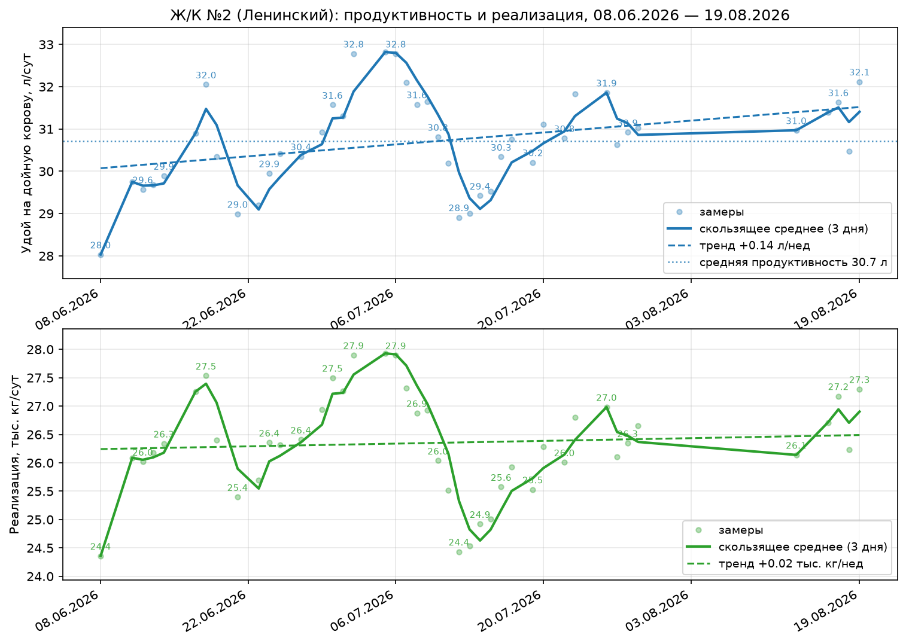

# Отчёт по производственным показателям Ж/К №2 Ленинский

**Период:** 08.06.2026 — 19.08.2026 · **Объект:** Ж/К №2 Ленинский · **Дата:** 19.08.2026

---

## Резюме

- **Удой на корову вырос с 28,0 до 32,1 л/сут (+4,1 л).** Средняя продуктивность периода — 30,7 л/сут, тренд +0,14 л/нед.
- **Реализация молока выросла с 24,4 до 27,3 тыс. кг/сут (+2,9 тыс. кг).**
- **Июльский провал восстановлен:** жара +29…+33 °C (07.07–10.08) опустила удой с пика 32,8 (02.07) до 28,9 л/сут (21.07); с похолоданием до +19…+23 °C удой восстановился до 32,1 л/сут.
- **Рост по группам широкий:** к замеру 12.08 продуктивность выросла в 10 из 12 групп за месяц; наибольший прирост — группа 9 (+2,4 л/сут) и группа 3 (+1,3).
- **Поголовье и качество:** дойные головы сократились с 869 до 850 (−19); жирность стабильна — 3,8–3,9%.

## Динамика по комплексу в целом — положительная

За период удой на корову прибавил +4,1 л/сут, реализация — +2,9 тыс. кг/сут. Рост достигнут при сокращении поголовья на 19 голов, то есть за счёт продуктивности, а не числа коров. Максимальные значения периода — 32,8 л/сут и 27,9 тыс. кг/сут реализации на 02–06.07.

Динамика периода делится на три фазы: рост до пика 32,8 л/сут (08.06–02.07), снижение до 28,9 л/сут на фоне устойчивой жары +29…+33 °C (07.07–21.07), восстановление до 32,1 л/сут после снижения температуры до +19…+23 °C (16.08–19.08). Тренд за весь период остаётся положительным: +0,14 л/нед по удою и +0,02 тыс. кг/нед по реализации.

## Динамика по группам — рост в 10 из 12 групп за месяц

За месяц (10.07 → 12.08) продуктивность выросла в 10 из 12 групп. Наибольший прирост: группа 9 — +2,4 л/сут, группа 3 — +1,3, группа 1 — +1,1, группа 4 — +1,0. 

За весь период от начала работы (09.06 → 12.08, 64 дня) наибольший прирост — группа 1 (+5,9 л/сут). Следом группы 4 (+1,8, ΔDIM +13) и 3 (+1,2, ΔDIM +17). Группа 19 (+7,2 л/сут за период) из сравнения исключена — аномалия данных (см. выше). Средние по DIM группы 5–8 за период стоят на месте (−0,3…+0,0 л/сут) — они приняли на себя основной удар июльской жары (−3,0…−3,1 л/сут за 07.07–10.07) и к 12.08 восстановились лишь частично.

Группы 1–8 показывают типичную кривую лактации: максимальная продуктивность у групп с низким DIM (38,0–38,3 л/сут), плавное снижение по мере его роста.

---

## Данные

### Общие показатели

| Показатель                                   | Начало периода (08.06) | Конец периода (19.08) | Изменение |
| ------------------------------------------------------ | ----------------------------------: | --------------------------------: | -----------------: |
| Удой на корову, л/сут                  |                                28,0 |                              32,1 |     **+4,1** |
| Реализация молока, тыс. кг/сут |                                24,4 |                              27,3 |     **+2,9** |
| Дойные головы, гол.                     |                                 869 |                               850 |               −19 |
| Жирность, %                                    |                                 3,9 |                               3,8 |              −0,1 |

*Рис. 1. Удой на корову (верх) и реализация молока (низ): замеры, скользящее среднее за 3 дня, линейный тренд (2026-06-08 — 2026-08-19).*

### Продуктивность по группам

| Группа | DIM 12.08 | Удой 09.06, л/сут | Удой 07.07, л/сут | Удой 10.07, л/сут | Удой 12.08, л/сут | Изм. 09.06→12.08 |
| -----------: | --------: | ------------------------: | ------------------------: | ------------------------: | ------------------------: | -------------------: |
|            1 |        44 |                      32,1 |                      39,3 |                      36,9 |                      38,0 |       **+5,9** |
|            2 |        78 |                      38,1 |                      38,5 |                      37,6 |                      38,2 |                 +0,1 |
|            3 |       121 |                      37,1 |                      39,1 |                      37,0 |                      38,3 |       **+1,2** |
|            4 |       178 |                      33,2 |                      37,0 |                      34,0 |                      35,0 |       **+1,8** |
|            5 |       239 |                      32,0 |                      34,5 |                      31,5 |                      31,7 |                −0,3 |
|            6 |       284 |                      29,1 |                      31,4 |                      28,3 |                      29,1 |                  0,0 |
|            7 |       333 |                      25,6 |                      27,1 |                      25,3 |                      25,4 |                −0,2 |
|            8 |       342 |                      25,7 |                      27,3 |                      25,2 |                      25,7 |                  0,0 |
|            9 |       370 |                        — |                        — |                      23,4 |                      25,8 |                   — |
|          15* |       141 |                       9,5 |                      17,5 |                      17,8 |                      13,2 |                 +3,7 |
|           19 |       208 |                      20,9 |                      19,9 |                      20,5 |                      28,1 |       **+7,2** |
|          22* |       567 |                       8,6 |                      12,9 |                      18,5 |                       2,7 |                −5,9 |

*Рис. 2. Сравнение продуктивности по группам на 09.06.2026, 07.07.2026, 10.07.2026 и 12.08.2026.*

---

**Отчёт составил:** ведущий технолог ЗАО «Консул» Сергеев С.А.

 
 
 

______________________ /Сергеев С.А./

