<h1 style="text-align:center">Технологический отчёт</h1>

**Объект:** Ж/К №2 Ленинский, КТ Зенченко (симменталы, ~870 дойных коров) · **Период работы:** 08.06 — 02.09.2026 · **Дата отчёта:** 08.09.2026

> Единицы: все показатели продуктивности — в литрах на корову в сутки (л/сут), как в сводках комплекса и срезах DairyPlan; реализация — тыс. кг/сут (как в приёмке).

---

## Ключевые показатели

| Показатель                                                                        | Было (08–10.06) |         Стало (19.08–02.09) |                                           Изменение |
| ------------------------------------------------------------------------------------------- | -------------------: | --------------------------------: | -----------------------------------------------------------: |
| Удой на корову, л/сут                                                       |                 28,0 | 32,1 пик (19.08); ~31 к 02.09 |                                               **+4,1** |
| Реализация молока, тыс. кг/сут                                      |                 24,4 |                              27,3 |                                               **+2,9** |
| Дойные коровы, гол.                                                          |                  869 |                               850 |                                                         −19 |
| Парный эффект (741 корова, 30 дней)                                   |                   — |   +2,4 кг (95% ДИ +1,9…+2,8) |                                       Приложение 1 |
| Тот же диапазон 2025 года (633 коровы)                               |                   — |                        −0,7 кг |                                       Приложение 1 |
| Часть прибавки за счёт новых отёлов (не кормления) |                   — |                               18% |                                       Приложение 1 |
| Выбытие дойных (10.06–31.08)                                                  |            11 (2025) |                         14 (2026) | в пределах разброса, Приложение 2 |
| Кетоны у новотельных (BHB, 3 замера)                                |                   — |  в допустимой зоне |                                       Приложение 3 |
| Падеж молодняка (10.06–31.08)                                                |            10 (2025) |                          4 (2026) |   ниже прошлого года, Приложение 2 |

**Рекомендации на ближайшие 60–90 дней:** сохранить действующие рационы и режим кормления; плановый контроль упитанности (BCS); кетоны (BHB) у групп раздоя при следующем отборе крови — высокий отклик новотельных коров требует контроля, чтобы не допустить чрезмерной мобилизации жира; разбор группы 19 (соматика); отдельный аудит условий содержания транзитной группы — повторяющиеся разрывы тазобедренных связок (14% всех причин забоя, подробно — Приложение 2).

## Что это значит

Коровы стали давать больше молока. Рост связан именно с кормлением и технологией, а не со случайными факторами. Здоровье стада не ухудшилось. Сохраняем текущий режим, контролируем упитанность, кетоны и группу 19.

---

Работа с комплексом началась 08.06.2026. С 10.06.2026 введены скорректированные рационы для всех производственных групп: убрана лишняя солома (доля снижена на 73%, компенсирована сенажом), улучшена физическая структура кормосмеси. Параллельно введены технологические меры: контроль остатков и сухого вещества, двухразовое кормление новотельных коров, чистка остатков у сухостоя, введены кормовые добавки производства ЗАО "Консул".

Дальше — ежемесячное технологическое сопровождение. В июле проба пенсильванских сит (08.07) подтвердила, что кормосмесь на практике соответствует расчётной структуре. В июльскую жару (до +33 °C) рацион не меняли — производили мониторинг остатков, и после похолодания удой восстановился. В августе добавили замеры кетонов у новотельных (17.08, 26.08, 02.09) и контроль выбытия.

## Результаты

За период удой на корову вырос **с 28,0 до 32,1 л/сут (+4,1)**, реализация молока — **с 24,4 до 27,3 тыс. кг/сут (+2,9)**. При этом поголовье сократилось на 19 голов — рост получен за счёт продуктивности, а не числа коров. Тренд положительный по всему периоду и сохраняется после спада жары.

В конце августа зафиксировано краткосрочное снижение продуктивности (25.08: 28,4 л/сут) с восстановлением к 01–02.09 (~31 л/сут). Отдельно отмечаем: 19.08.2026 проводилась вакцинация против бруцеллёза (штамм 82); её связь со снижением не оценивалась.

Отдельно проверили, чем вызван рост — кормлением или случайными факторами (подробные расчёты — Приложение 1). Три независимые проверки говорят одно: **это следствие корректировки рациона 10 июня.** Коровы, доившиеся ещё до изменения, прибавили за месяц +2,4 кг на голову (741 корова, поимённо; 95% ДИ +1,9…+2,8), тогда как год назад в те же сроки такие же коровы теряли 0,7 кг. Какая часть прибавки объясняется новыми отёлами, а не кормлением, измерено отдельно — 18%. И проверка на совпадение: расчёт выполнен для 34 случайных дат за полтора года — ни одна не дала похожего роста, эффект привязан именно к 10 июня.

**Выбытие дойных коров после корректировки не выросло** — 14 голов против 11 в том же диапазоне 2025 года, в пределах обычного разброса (подробно — Приложение 2). **Кетоны у новотельных в допустимой зоне** по трём замерам с учётом породы (Приложение 3).

## Что установлено и что поддерживается данными

**Установлено (прямые данные):**

- средний удой и реализация выросли;
- одни и те же коровы, доившиеся и до, и после корректировки, прибавили (+2,4 кг за 30 дней; 95% ДИ +1,9…+2,8);
- в сопоставимом диапазоне 2025 года надой таких же коров снизился (−0,7 кг);
- лишь 18% прибавки объясняется новыми отёлами, а не кормлением;
- после 10 июня выбытие дойных коров не выросло сверх обычного разброса.

**Поддерживается данными:**

- положительный эффект комплекса мероприятий (рацион + технологические меры вместе);
- наиболее выраженный эффект у новотельных коров (0–10 дней: +11,0 кг);
- кетоны у новотельных в норме, единичные отклонения ожидаемы для породы.

## Вывод

После внедрения 10.06.2026 комплекса кормовых и технологических мероприятий продуктивность стада выросла. Парный анализ 741 коровы показал прирост среднего надоя на 2,4 кг за 30 дней против снижения на 0,7 кг в сопоставимом периоде 2025 года. Рост наблюдался преимущественно у коров ранней и средней лактации, а не только за счёт новых отёлов. По доступным данным, увеличение продуктивности не сопровождалось ухудшением выбытия дойных коров или массовым ростом кетонов. Рацион и технологический режим целесообразно сохранить с продолжением мониторинга.

## Ограничения отчёта

- Экономических данных (цена молока, стоимость рациона) в работе не было — экономическая оценка не производилась.
- Причины выбытия указаны не у всех записей и в свободной форме (Приложение 2).
- Падёж взрослых коров в выгрузке не зафиксирован — если коровы регистрируются иначе, они в этот архив не попали.
- Пороги кетонов адаптированы под породу: референсы выведены на голштинских стадах, для симменталов действует породная оговорка (Приложение 3).
- Часть сравнений по производственным группам — непарная (срезы разного состава), парный вывод опирается на когорту 741 коровы.

### Приложения

1. **Доказательная аналитика продуктивности**
2. **Выбытие из стада (забой и падеж)**
3. **Мониторинг кетонов ранней лактации**

---

Составил: ведущий технолог ЗАО «Консул» Сергеев С.А.
Дата составления: 08.09.2026
Подпись: ______________

# Приложение 1. Доказательная аналитика продуктивности

**Структура стада по дню в доении и продуктивность групп — 01.2025 → 09.2026**

> Доящееся стадо = все строки среза, кроме группы («БРАК») и строк без статуса.
> DIM пересчитан на дату данных каждого среза.
> Продуктивность группы = средний надой по коровам с надоем > 0 (в скобках — их число).
> Диапазоны: ранняя лактация 0–100 дн, средняя 100–200 дн, поздняя 200+ дн.

## Год к году по месяцам: группа 0–100 дн (средний надой, кг)

Май 2026 (месяц до корректировки): **35.7** кг — внутригодовая база для сравнения.

| Месяц | 2025 | 2026 | Δ год-к-году | Δ к маю 2026 |
| ---------- | ---: | ---: | --------------------: | ----------------: |
| 01         | 31.9 | 32.5 |                  +0.6 |              -3.2 |
| 02         | 31.8 | 34.9 |                  +3.0 |              -0.8 |
| 03         | 32.5 | 35.7 |                  +3.2 |              +0.0 |
| 04         | 32.1 | 35.3 |                  +3.2 |              -0.4 |
| 05         | 33.5 | 35.7 |                  +2.2 |              +0.0 |
| 06         | 33.7 | 34.8 |                  +1.1 |              -0.9 |
| 07         | 31.9 | 38.8 |                  +7.0 |              +3.1 |
| 08         | 33.7 | 37.2 |                  +3.5 |              +1.5 |
| 09         | 33.2 | 35.6 |                  +2.4 |              -0.1 |

**Вывод:** рост коров ранней лактации начался после корректировки 10.06, а не до неё: июнь ещё ниже мая (−0,9 к внутригодовой базе), июль — +7,0 к прошлому году и +3,1 к маю. В 2025 июльского подъёма не было (наоборот, 31,9 против 33,7 в июне).

## Парный анализ до/после: одни и те же коровы, диапазон 10.06 → 10.07.2026 (30 дней)

> Расчёт по поимённым срезам DairyPlan. В когорту входят только коровы, доившиеся на 10.06.2026 и найденные в срезе 10.07.2026 — вошедших после отёлов мая здесь нет.
> Доящихся на 10.06.2026: 855; в паре (надой > 0 в обоих срезах, DIM сошёлся): 741.

| Когорта (DIM на 10.06)                   | N   | Надой 10.06 | Надой 10.07 | Δ средн. | 95% ДИ             | Выросли | Упали |
| ------------------------------------------------- | --- | ---------------- | ---------------- | -------------- | -------------------- | -------------- | ---------- |
| 0–10 (двухразовое кормление) | 11  | 27.3             | 38.3             | +11.0          | +6.2…+15.9          | 9 (82%)        | 1 (9%)     |
| 10–60 (рост к пику)                     | 139 | 33.2             | 40.3             | +7.1           | +5.9…+8.4           | 118 (85%)      | 20 (14%)   |
| 60–100 (опыт, плато)                    | 68  | 37.0             | 39.5             | +2.5           | +0.8…+4.1           | 47 (69%)       | 21 (31%)   |
| 100–200 (контроль)                       | 166 | 34.2             | 36.4             | +2.2           | +1.5…+3.0           | 118 (71%)      | 42 (25%)   |
| 200+ (контроль, спад)                 | 357 | 25.9             | 26.2             | +0.3           | −0.2…+0.8          | 192 (54%)      | 149 (42%)  |
| ИТОГО                                        | 741 | 30.2             | 32.5             | **+2.4** | **+1.9…+2.8** | 484 (65%)      | 233 (31%)  |

**Вывод:** коровы, доившиеся ещё до корректировки, прибавили за 30 дней +2,4 кг на голову (95% ДИ +1,9…+2,8), выросли 65% из них. Сильнее всех — группа 0–10 дней (+11,0 кг): она получала двухразовое кормление.

### Сезонный контроль: тот же диапазон 2025 года (01.06 → 01.07.2025, 633 коровы в паре)

| Когорта (DIM на 01.06) | N   | Надой 01.06 | Надой 01.07 | Δ средн.  |
| ------------------------------- | --- | ---------------- | ---------------- | --------------- |
| 0–10                           | 14  | 25.9             | 35.2             | +9.4            |
| 10–60                          | 51  | 34.8             | 37.2             | +2.4            |
| 60–100                         | 45  | 35.9             | 34.9             | −1.0           |
| 100–200                        | 176 | 31.7             | 30.7             | −1.0           |
| 200+                            | 347 | 20.3             | 19.0             | −1.3           |
| ИТОГО                      | 633 | 25.9             | 25.2             | **−0.7** |

**Вывод:** годом ранее в тот же летний диапазон такие же по положению коровы не росли, а снижались (−0,7 кг), включая жару. Сезон сам по себе роста не даёт.

### Двойное различие: опыт (0–100 дн) против контроля внутри стада (100+)

Рацион 0–100 дней получили только коровы ранней лактации; коровы 100+ — внутренний контроль. Разница приростов сравнивается с той же разницей год назад — двойное различие снимает сезонность и общий фон хозяйства.

| Год                                   | Δ опыт 0–100 | Δ контроль 100+ | Разница (опыт − контр) |
| ---------------------------------------- | ------------------ | ------------------------ | --------------------------------------- |
| 2026 (корректировка 10.06)  | +5.9               | +0.9                     | **+5.0**                          |
| 2025 (без корректировки) | +1.9               | −1.2                    | +3.1                                    |

**Двойное различие: (+5.0) − (+3.1) = +1.9 кг** — чистый эффект корректировки на целевую группу поверх сезона и фона.

### Декомпозиция: сколько дал состав (отёлы), сколько — сами коровы

| Диапазон            | Средний надой до → после | Δ всего  | старые коровы | вошедшие (отёлы) | выбывшие   |
| --------------------------- | -------------------------------------------- | -------------- | ------------------------- | ----------------------------- | ------------------ |
| **10.06→10.07.2026** | 29.2 → 32.9                                 | **+3.7** | +2.1                      | +0.7 (91 гол.)             | +1.0 (89 гол.)  |
| 01.06→01.07.2025           | 25.5 → 25.6                                 | +0.2           | −0.4                     | +0.6 (68 гол.)             | −0.1 (82 гол.) |

Из общего роста +3,7 кг вклад отёлов (вошедших) — +0,7 кг, то есть 18%. Остальное — рост коров, доившихся ещё до корректировки, и уход слабых.

### Плацебо-тест: 34 фиктивные даты за 21 месяц

**Что такое плацебо-тест, простыми словами.** Мы проверили, не совпадение ли это: тот же самый расчёт прогнали для 34 выдуманных дат за полтора года. Если бы молоко росло «само» — от сезона, отёлов или общего фона года, — то какая-нибудь из выдуманных дат показала бы такой же рост, как реальная. Поэтому и сравниваем: что дала бы «плацебо-дата», где ничего не меняли, против даты, когда рацион изменили.

Результат по всем 30-дневным диапазонам 2025–2026 до 10.06.2026:

- **Прирост всей когорты: плацебо пройден.** Реальная дата +2,4 кг — максимум за весь период (лучшее плацебо +1,2 кг). Ни один диапазон за 21 месяц не дал такого роста одних и тех же коров за 30 дней.

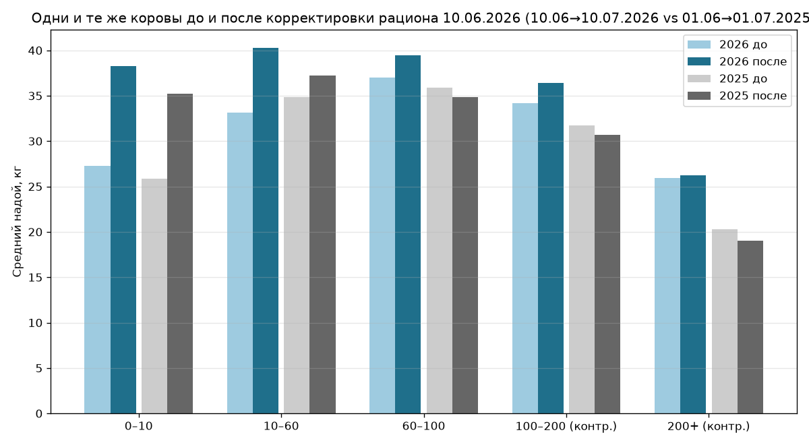

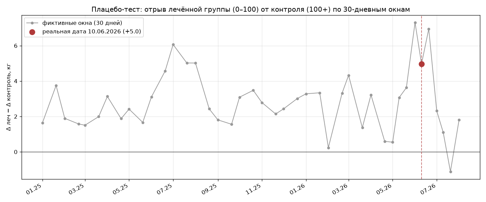

## Графики

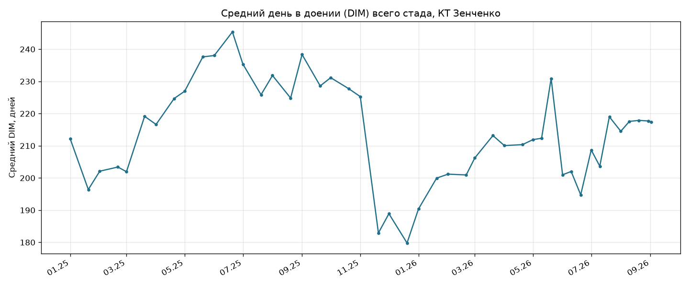

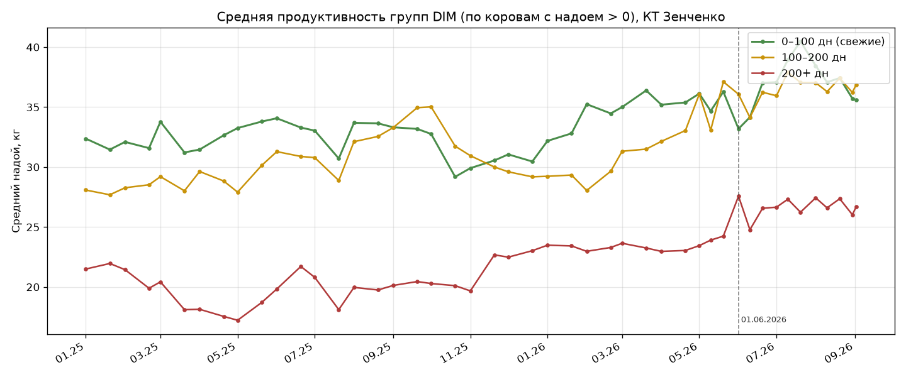

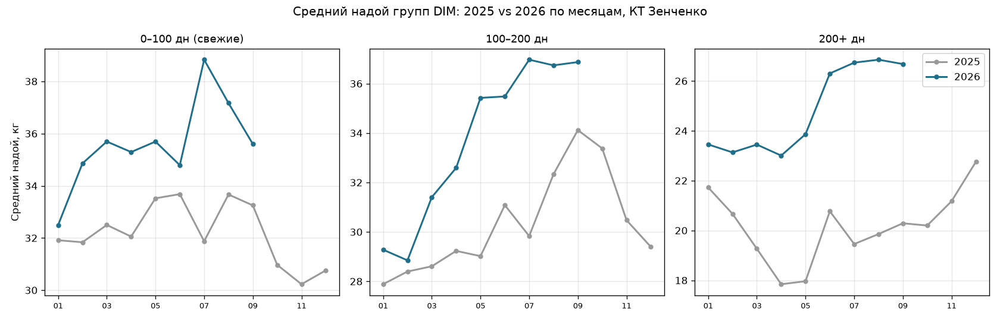

## Производственные группы по поимённым срезам (10.06 → 02.09.2026)

> Средний надой группы по коровам с надоем > 0; в скобках — число доящихся. Группа («БРАК») и строки без статуса исключены.
> Состав групп между срезами меняется (переводы) — это сравнение групповых средних, не парный анализ.

| Группа | 10.06.26 | 20.06.26 | 01.07.26 | 10.07.26 | 20.07.26 | 01.08.26 | 10.08.26 | 20.08.26 | 30.08.26 | 02.09.26 |
| ------------ | ---------: | ---------: | ---------: | ---------: | ---------: | ---------: | ---------: | ---------: | ---------: | ---------: |
| 1            |  33.3 (88) |  36.4 (87) |  37.1 (88) |  39.8 (84) |  38.3 (84) |  39.6 (92) |  37.1 (85) |  37.5 (95) |  37.0 (92) |  36.6 (94) |
| 2            |  36.4 (82) |  40.8 (91) |  39.9 (79) |  41.0 (87) |  48.2 (73) |  41.9 (87) |  40.4 (89) |  41.1 (95) |  38.5 (98) |  39.1 (96) |
| 3            |  36.6 (84) |  38.1 (91) |  38.4 (84) |  40.1 (91) |  40.7 (78) |  39.4 (83) |  39.1 (87) |  39.9 (87) |  39.3 (89) |  39.8 (89) |
| 4            |  33.2 (86) |  35.4 (92) |  35.8 (90) |  37.6 (92) |  34.8 (83) |  36.8 (89) |  36.7 (85) |  36.6 (93) |  34.9 (99) |  36.0 (98) |
| 5            |  30.8 (88) |  34.0 (94) |  34.0 (90) |  34.5 (92) |  32.5 (89) |  33.0 (92) |  32.6 (89) |  32.9 (90) |  31.5 (89) |  32.4 (96) |
| 6            |  29.7 (79) |  30.3 (76) |  30.0 (97) |  31.6 (90) |  29.4 (87) |  30.9 (77) |  28.7 (88) |  29.2 (86) |  28.4 (89) |  29.2 (91) |
| 7            |  25.9 (81) |  28.0 (74) |  28.0 (85) |  27.6 (93) |  26.6 (93) |  26.2 (89) |  25.3 (83) |  25.0 (91) |  24.2 (89) |  24.6 (91) |
| 8            |  25.4 (95) |  27.6 (78) |  27.1 (82) |  27.6 (73) |  26.1 (76) |  26.9 (73) |  25.7 (85) |  26.4 (76) |  24.9 (92) |  25.1 (93) |
| 9            |  23.6 (41) |  25.4 (39) |  26.2 (34) |  24.9 (32) |  22.3 (34) |  24.1 (43) |  25.4 (51) |  26.8 (46) |  24.6 (36) |  25.4 (37) |
| 15           |   18.6 (8) |  22.3 (12) |  21.0 (18) |  26.9 (15) |  27.8 (13) |  22.8 (17) |  20.7 (16) |  19.3 (12) |  24.0 (17) |  23.0 (19) |
| 19           |  24.3 (34) |  23.8 (34) |  24.1 (39) |  23.5 (37) |  23.7 (39) |  24.7 (54) |  25.8 (50) |  28.9 (49) |  23.1 (46) |  22.9 (40) |
| 22           |  15.7 (45) |  19.1 (36) |  20.9 (39) |  19.0 (33) |  16.5 (30) |  20.6 (20) |  11.9 (12) |         — |         — |         — |

**Вывод:** группы 1–5 (DIM до ~200) прибавили от 10.06 к 02.09 от +1,6 до +3,3 кг, пик — конец июля–начало августа (гр. 1: 39,6 на 01.08). Поздние группы 6–8 стоят на месте или чуть ниже — они дальше от мишени корректировки. По гр. 15, 19, 22 выводы не делаем: малые или меняющиеся составы (см. ограничения ниже).

### Год-к-году по группам: среднее августа 2025 против августа 2026

| Группа | Авг 2025 (срезов) | Авг 2026 (срезов) |    Δ |
| ------------ | -------------------------: | -------------------------: | ----: |
| 1            |                   32.3 (2) |                   37.8 (4) |  +5.5 |
| 2            |                   35.0 (2) |                   40.5 (4) |  +5.5 |
| 3            |                   36.6 (2) |                   39.4 (4) |  +2.8 |
| 4            |                   33.0 (2) |                   36.2 (4) |  +3.2 |
| 5            |                   30.1 (2) |                   32.5 (4) |  +2.4 |
| 6            |                   26.9 (2) |                   29.3 (4) |  +2.4 |
| 7            |                   16.7 (2) |                   25.2 (4) |  +8.5 |
| 8            |                   23.7 (2) |                   26.0 (4) |  +2.3 |
| 15           |                   19.4 (2) |                   21.7 (4) |  +2.4 |
| 19           |                   35.9 (2) |                   25.6 (4) | -10.2 |
| 22           |                    9.0 (2) |                   16.2 (2) |  +7.2 |

**Вывод:** все основные группы (1–8) выше прошлогоднего августа на +2,3…+8,5 кг. По гр. 19 (−10,2) и гр. 7 (+8,5) прямое сравнение ограничено.

### Оценка влияния сдвига DIM (контроль по тем же группам, 2025 год)

Средний DIM групп за диапазон вырос (состав групп «стареет» между срезами), поэтому часть динамики надоев могла бы объясняться сменой состава. Для оценки этого фактора рассмотрены те же производственные группы годом ранее за сопоставимый календарный диапазон (01.06 → 20.08.2025 против 10.06 → 02.09.2026).

| Группа | 2025: надой, Δ (DIM до → после) | 2026: надой, Δ (DIM до → после) |
| ------------ | --------------------------------------------- | --------------------------------------------- |
| 1            | 36.0 → 31.9 (-4.1; DIM 35 → 26)             | 33.3 → 36.6 (+3.3; DIM 21 → 59)             |
| 2            | 39.2 → 34.5 (-4.8; DIM 98 → 63)             | 36.4 → 39.1 (+2.7; DIM 52 → 81)             |
| 3            | 36.4 → 36.0 (-0.3; DIM 146 → 111)           | 36.6 → 39.8 (+3.2; DIM 106 → 130)           |
| 4            | 33.8 → 33.1 (-0.7; DIM 190 → 176)           | 33.2 → 36.0 (+2.8; DIM 169 → 192)           |
| 5            | 30.3 → 28.6 (-1.7; DIM 229 → 230)           | 30.8 → 32.4 (+1.6; DIM 213 → 241)           |
| 6            | 27.8 → 27.1 (-0.7; DIM 305 → 317)           | 29.7 → 29.2 (-0.6; DIM 239 → 279)           |
| 7            | 16.3 → 14.7 (-1.6; DIM 398 → 388)           | 25.9 → 24.6 (-1.3; DIM 310 → 330)           |
| 8            | 27.8 → 21.7 (-6.1; DIM 322 → 329)           | 25.4 → 25.1 (-0.3; DIM 338 → 340)           |

В **2025** все группы 1–8 за тот же летний диапазон снизились (−0,3…−6,1 кг). При этом DIM групп 1 и 2 снизился (35→26 и 98→63) — состав этих групп в 2025 становился свежее, что само по себе работает на рост среднего надоя; фактически надой снизился. В **2026** гр. 1–5 выросли (+1,6…+3,3 кг) при росте DIM на 28–38 дней, а постпиковые гр. 3–5 (DIM выше 100) выросли при физиологически ожидаемом в этой фазе спаде. Итог этой проверки: сдвиг DIM рост не объясняет — группы выросли там, где по кривой лактации положено стоять на месте или снижаться.

**Как читать эти таблицы:** групповые средние хорошо показывают направление — и оно совпадает с парным анализом и противоположно прошлому лету. Но коровы между группами переводятся, а маленькие группы изменяются по одной-двум коровам, поэтому по одним этим средним эффект не докажешь. Главное доказательство — парный анализ до/после по одним и тем же коровам: состав когорты зафиксирован, переводы не мешают. Данные — в разделе «Парный анализ до/после» выше.

**Ограничения групповых средних (непарность, переводы):**

- Скачки между соседними срезами нефизиологичны для группы: гр. 3: 44,3 → 36,0 кг за 12 дней (20.05 → 01.06); гр. 5: 27,4 → 36,8 за тот же шаг; гр. 1: 36,7 → 31,2. В конце мая — начале июня шло перегруппирование: средние до и после него сопоставлять напрямую нельзя.
- Гр. 2 на 20.07: 48,2 кг (73 доящихся) — выброс против соседних срезов (41,0 и 41,9); требует проверки записи.
- Гр. 15: DIM за диапазон 10.06 → 02.09 сдвинулся 47 → 201 (календарно прошло 84 дня) — состав группы сменился полностью; сравнение «до/после» для неё непарное.
- Гр. 19 год-к-году: 35,9 → 25,6 кг (−10,2) и гр. 7: +8,5 кг — вероятно, иная роль/состав этих групп в 2025; прямое сравнение ограничено.
- Гр. 22 после 10.08.2026 в срезах отсутствует (расформирована); на 12.08 в ней была 1 голова.

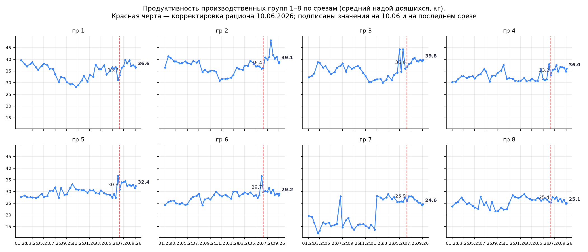

# Приложение 2. Выбытие из стада (забой и падеж)

**Выбытие из стада: забой и падеж — 2025-01-01 → 2026-08-31**

> Источник: DairyPlan (выгрузка 02.09.2026).
> Продажа и выбраковка не входят.
> Часть 1 — дойное стадо (животные с заполненной датой последнего отёла). Часть 2 — молодняк (без отёла).
> DIM при выбытии = дата выбытия − дата последнего отёла. Возраст = дата выбытия − дата рождения.

---

# Часть 1. Дойное стадо (97 записей)

> Падежа дойных коров в выгрузке нет: все записи «падеж» — молодняк (часть 2).
> Выбытие дойных = забой (в т.ч. вынужденный).

## 1.1. Помесячная статистика

| Месяц  | Забой | Падеж | Всего | Топ-причины месяца                                                                 |
| ----------- | ---------: | ---------: | ---------: | -------------------------------------------------------------------------------------------------- |
| янв 2025 |         10 |          0 |         10 | после род порез (3), кетоз (3), острый мастит (1)                    |
| фев 2025 |         11 |          0 |         11 | кетоз (5), острый мастит (3), после род парез (1)                    |
| мар 2025 |          8 |          0 |          8 | кетоз (3), синее вымя,остм (1), с.в,интокс-ция (1)                    |
| апр 2025 |          6 |          0 |          6 | синее вымя,остм (2), перитонит (1), острая алергия (1)          |
| май 2025 |          8 |          0 |          8 | некроз тканей (2), хрон мастит (2), разрыв влагалищ (1)        |
| июн 2025 |          4 |          0 |          4 | хрон мастит (1), хронич мастит (1), перитонит (1)                   |
| июл 2025 |          3 |          0 |          3 | растяжение тбс (1), разрыв тбс связ (1), перелом конечн (1) |
| авг 2025 |          4 |          0 |          4 | энтерит (2), гангрена вымени (1), отек вымени (1)                   |
| сен 2025 |          2 |          0 |          2 | мн-ые абсцессы (1), бронхопневмания (1)                                 |
| окт 2025 |          5 |          0 |          5 | выпадение матки (1), разрыв тбс (1), перитонит (1)                 |
| ноя 2025 |          2 |          0 |          2 | разрыв тбс (1), закупорка книжк (1)                                         |
| дек 2025 |          2 |          0 |          2 | разрыв тбс (1), острая тимпания (1)                                         |
| янв 2026 |          2 |          0 |          2 | разрыв тбс (1), перитонит (1)                                                    |
| фев 2026 |          3 |          0 |          3 | тимпания (2), разрыв тбс (1)                                                      |
| мар 2026 |          3 |          0 |          3 | разрыв тбс (1), жир.дистр.печен (1), обил. кровот-ие (1)         |
| апр 2026 |          4 |          0 |          4 | в новоникольске (1), разрыв тбс (1), растяж-е связок (1)       |
| май 2026 |          6 |          0 |          6 | разрыв тбс (4), кетоз (1), бурсит,флегмона (1)                         |
| июн 2026 |          5 |          0 |          5 | разрыв тбс (1), острая тимпания (1), жир.дистр.печен (1)       |
| июл 2026 |          3 |          0 |          3 | разрывы тбс (1), растяжение тбс (1), с 26 группы (1)                 |
| авг 2026 |          6 |          0 |          6 | кетоз (1), абцесс брюшн.п (1), дистроф. печени (1)                   |

**Итого за период:** забой 97, всего 97.

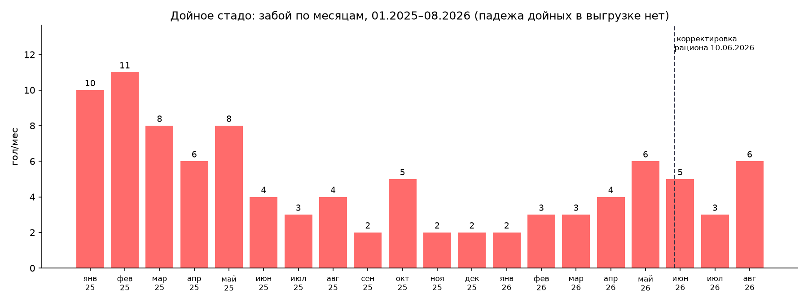

## 1.2. Причины забоя дойного стада

> Причины нормализованы по словарю (расшифровка сокращений, орфография); если отличается от записи — в скобках как записано.

| Причина                                                                                               |  N | Доля |
| ------------------------------------------------------------------------------------------------------------ | -: | -------: |
| кетоз                                                                                                   | 14 |      14% |
| разрыв тазобедренных связок (записано: разрыв тбс)                 | 12 |      12% |
| острый мастит                                                                                    |  4 |       4% |
| синее вымя (острый мастит) (записано: синее вымя,остм)             |  4 |       4% |
| перитонит                                                                                           |  4 |       4% |
| хронический мастит (записано: хрон мастит)                                |  4 |       4% |
| после род порез                                                                                 |  3 |       3% |
| тимпания                                                                                             |  3 |       3% |
| энтерит                                                                                               |  3 |       3% |
| интоксикация                                                                                     |  2 |       2% |
| после род парез                                                                                 |  2 |       2% |
| выпадение матки                                                                                |  2 |       2% |
| некроз тканей                                                                                    |  2 |       2% |
| растяжение тазобедренных связок (записано: растяжение тбс) |  2 |       2% |
| острая тимпания                                                                                |  2 |       2% |

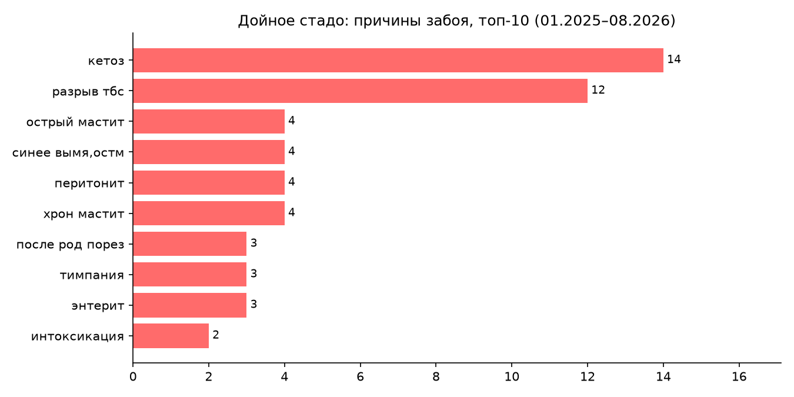

**Отдельного внимания требуют тазобедренные связки:** разрыв (12 случаев) и растяжение (2) вместе дают 14% всех причин забоя и повторяются из месяца в месяц. Это травматическая, а не обменная причина: типичные источники — скользкие полы, скученность на транзите, спешка при подъёме коров. Рекомендуется отдельный аудит транзитной группы и условий содержания (покрытие проходов, плотность, организация подъёма).

## 1.3. Выбытие после корректировки рациона 10.06.2026 — сравнение по месяцам

**Главное: выбытие дойных после корректировки не выросло.** В том же диапазоне 2025 года — 11 голов, в 2026 — 14; при месячном разбросе 2–11 голов эта разница в пределах обычного разброса.

### Каждый месяц 2026 против того же месяца 2025 (забой дойных)

| Месяц               |         2025 |         2026 |            Δ |
| ------------------------ | -----------: | -----------: | ------------: |
| янв                   |           10 |            2 |            -8 |
| фев                   |           11 |            3 |            -8 |
| мар                   |            8 |            3 |            -5 |
| апр                   |            6 |            4 |            -2 |
| май                   |            8 |            6 |            -2 |
| июн                   |            4 |            5 |            +1 |
| июл                   |            3 |            3 |            +0 |
| авг                   |            4 |            6 |            +2 |
| **янв–авг** | **54** | **32** | **-22** |

### Год-к-году: диапазон после 10.06 (10.06 — 31.08)

| Период      | Забой дойных |
| ----------------- | ----------------------: |
| 10.06–31.08.2025 |                      11 |
| 10.06–31.08.2026 |                      14 |

Разница: **+3 головы**. Состав обеих выборок — ниже.

#### Диапазон 10.06–31.08.2026 — состав (14 голов)

| Дата выбытия | Бирка    | DIM | Причина                |
| ----------------------- | ------------- | --: | ----------------------------- |
| 2026-06-13              | DE0953339191  |   0 | разрыв тбс           |
| 2026-06-16              | DE0954774049  |  82 | острая тимпания |
| 2026-06-17              | 84498830/1552 | 355 | жир.дистр.печен  |
| 2026-06-19              | KZT83788272   |  27 | флегмона,хром-а  |
| 2026-06-27              | DE0954820240  |  10 | кетоз                    |
| 2026-07-01              | DE0956551800  | 263 | разрывы тбс         |
| 2026-07-28              | DE0953747579  | 546 | растяжение тбс   |
| 2026-07-28              | KZT183790028  | 646 | с 26 группы            |
| 2026-08-04              | DE0953931658  |   9 | кетоз                    |
| 2026-08-13              | 84662610/2470 |  92 | абцесс брюшн.п    |
| 2026-08-13              | 84278798/818  |  30 | дистроф. печени  |
| 2026-08-21              | DE0956689615  | 149 | гипергликемия    |
| 2026-08-21              | DE0954705672  | 144 | вывих тбс             |
| 2026-08-24              | 84582692/2840 |   1 | артроз перед.к    |

#### Диапазон 10.06–31.08.2025 — состав (11 голов)

| Дата выбытия | Бирка    | DIM | Причина                |
| ----------------------- | ------------- | --: | ----------------------------- |
| 2025-06-19              | DE0954279203  | 138 | хрон мастит         |
| 2025-06-19              | DE0953483031  | 363 | хронич мастит     |
| 2025-06-21              | DE0956012673  |   3 | перитонит            |
| 2025-06-29              | DE0953835439  | 127 | маст, пневмония  |
| 2025-07-02              | DE0953501627  |   4 | растяжение тбс   |
| 2025-07-22              | DE0953529892  | 479 | разрыв тбс связ  |
| 2025-07-26              | DE0956012680  | 253 | перелом конечн   |
| 2025-08-06              | 84197212/602  | 406 | гангрена вымени |
| 2025-08-21              | DE0956801575  |  14 | отек вымени         |
| 2025-08-22              | DE0954029084  | 157 | энтерит                |
| 2025-08-27              | 84498850/1532 | 101 | энтерит                |

#### Сопоставление диапазонов по группам причин

Причины сгруппированы. Изменения по группам между диапазонами — 1–3 головы, кроме метаболических заболеваний (0 → 5); при таких числах процентное изменение не вычисляется — это единичные случаи, а не тренд. Рост метаболических заболеваний (кетоз два случая, две дистрофии печени, гипергликемия) отмечаем без интерпретации тренда — наблюдение согласуется с рекомендацией отчёта контролировать кетоны и упитанность у групп раздоя.

| Группа причин         | 2025 | 2026 |
| --------------------------------- | ---: | ---: |
| метаболические заболевания |    0 |    5 |
| травма/хромота       |    3 |    6 |
| послеродовые/вымя |    4 |    0 |
| ЖКТ                            |    2 |    1 |
| прочее                      |    2 |    2 |

Медиана DIM при выбытии: диапазон 2025 — 138 дн (N=11); диапазон 2026 — 87 дн (N=14).

Из 6 случаев 2026 года с DIM≤30 три — травмы и хроническая хромота (включая выбраковку по хроническому артрозу на 1-й день после отёла) — к переходному периоду и кормлению не относятся; метаболических заболеваний — три (кетоз, дистрофия печени).

Записей: **97** (все — забой).

| Медиана DIM | Среднее DIM | Доля ≤100 дн |
| -----------------: | -----------------: | ------------------: |
|                115 |                160 |                 47% |

| DIM, дн |  N | Доля |
| --------- | -: | -------: |
| 0–30     | 35 |      36% |
| 31–60    |  6 |       6% |
| 61–100   |  5 |       5% |
| 101–200  | 19 |      20% |
| 201–305  | 12 |      12% |
| 306+      | 20 |      21% |

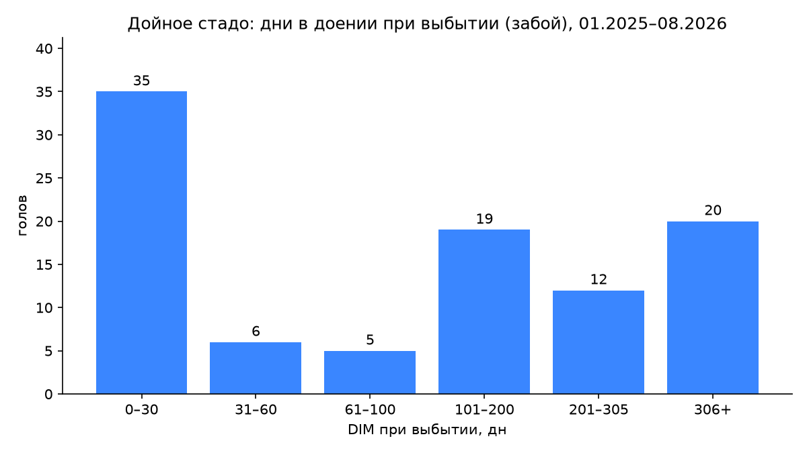

---

# Часть 2. Молодняк — животные без отёла (171 записей)

> Забой 29, падеж 142.
> По возрасту при выбытии: падеж — медиана < 1 года (140 из 142 младше года); забой — медиана 1,3 года.

## 2.1. Помесячная статистика

| Месяц  | Забой | Падеж | Всего | Топ-причины месяца                                                                  |
| ----------- | ---------: | ---------: | ---------: | --------------------------------------------------------------------------------------------------- |
| янв 2025 |          1 |          5 |          6 | перитонит (3), трехногая (1), диарея (1)                                    |
| фев 2025 |          0 |         10 |         10 | новоникольск (2), перитонит (2), диарея (1)                              |
| мар 2025 |          2 |          5 |          7 | новоникольск (3), перитонит (2), геморр.энтерит (1)               |
| апр 2025 |          0 |          3 |          3 | катаральная бп (1), язва сычуга (1), перитонит (1)                  |
| май 2025 |          0 |          8 |          8 | геморр.энтерит (3), неон-я пнев-ния (1), пупочный сепсис (1) |
| июн 2025 |          1 |          4 |          5 | энтерит (2), перелом ноги (1), язва сычуга (1)                          |
| июл 2025 |          2 |          3 |          5 | на откорме (1), перелом конечн (1), тимпания рубца (1)           |
| авг 2025 |          1 |          6 |          7 | пуп.сепсис (2), перелом конечн (1), язва сычуга (1)                 |
| сен 2025 |          2 |         14 |         16 | абомазит,энтер (2), бронхопневмания (2), тимпания (1)           |
| окт 2025 |          0 |         23 |         23 | энтерит (5), гастроэнтерит (4), абомазит. (3)                           |
| ноя 2025 |          0 |         13 |         13 | энтерит (3), непроход.кишечн (3), перитонит (2)                       |
| дек 2025 |          0 |         11 |         11 | энтерит (5), перитонит (2), с 26 группы (1)                                  |
| янв 2026 |          2 |         13 |         15 | энтерит (4), колики (4), разрыв тбс (2)                                       |
| фев 2026 |          0 |          5 |          5 | энтерит (2), перитонит (1), бронхопневмания (1)                      |
| мар 2026 |          1 |          3 |          4 | энтерит (2), разрыв пут.суст (1), вздутие (1)                            |
| апр 2026 |          2 |          6 |          8 | пневмания (3), общепит,с 26 гр (2), энтерит (2)                           |
| май 2026 |          9 |          5 |         14 | общепит,с 26 гр (7), казеин-й безоар (3), ножки сломанные (1)  |
| июн 2026 |          4 |          1 |          5 | общепит,с 26 гр (2), артроз,сильн хр (1), гн-ая бронх-ия (1)      |
| июл 2026 |          2 |          2 |          4 | гнойн.бронхопн. (1), флегмона зп.зл (1), остр гем.нефрит (1)  |
| авг 2026 |          0 |          2 |          2 | с 26 группы (1), пневмания (1)                                                      |

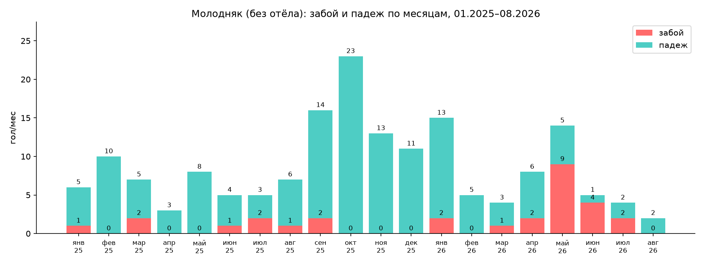

## 2.2. Причины падежа молодняка

> Причины нормализованы по словарю; если отличается от записи — в скобках как записано.

| Причина                                                                                    |  N | Доля |
| ------------------------------------------------------------------------------------------------- | -: | -------: |
| энтерит                                                                                    | 26 |      18% |
| перитонит                                                                                | 17 |      12% |
| язва сычуга                                                                             |  7 |       5% |
| бронхопневмония                                                                   |  7 |       5% |
| пневмония                                                                                 |  6 |       4% |
| гастроэнтерит                                                                        |  5 |       4% |
| геморрагический энтерит (записано: геморр.энтерит)     |  4 |       3% |
| колики                                                                                      |  4 |       3% |
| новоникольск                                                                          |  3 |       2% |
| абомазит                                                                                  |  3 |       2% |
| непроходимость кишечника (записано: непроход.кишечн) |  3 |       2% |
| казеиновый безоар (записано: казеин-й безоар)                |  3 |       2% |
| диарея                                                                                      |  2 |       1% |
| отек легких                                                                             |  2 |       1% |

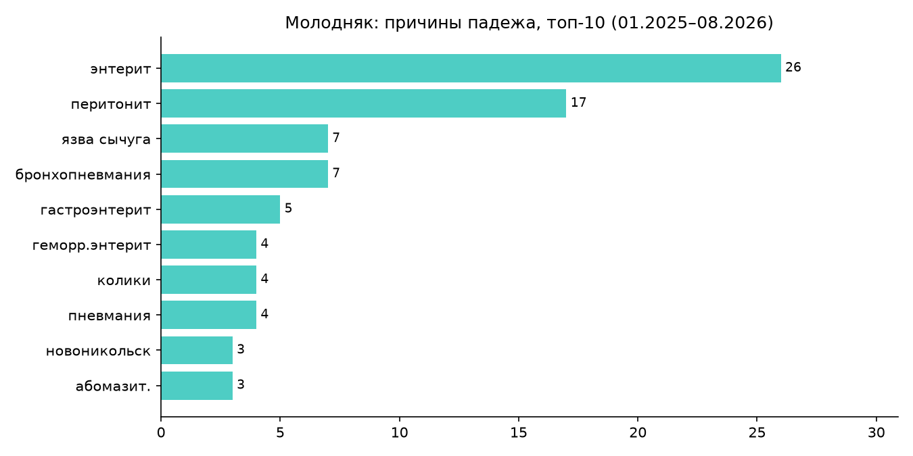

## 2.3. Выбытие молодняка после 10.06.2026 — сравнение по месяцам

### Каждый месяц 2026 против того же месяца 2025

| Месяц               |         2025 |         2026 |           Δ |
| ------------------------ | -----------: | -----------: | -----------: |
| янв                   |            6 |           15 |           +9 |
| фев                   |           10 |            5 |           -5 |
| мар                   |            7 |            4 |           -3 |
| апр                   |            3 |            8 |           +5 |
| май                   |            8 |           14 |           +6 |
| июн                   |            5 |            5 |           +0 |
| июл                   |            5 |            4 |           -1 |
| авг                   |            7 |            2 |           -5 |
| **янв–авг** | **51** | **57** | **+6** |

### Год-к-году: диапазон 10.06 — 31.08

| Период      | Забой | Падеж | Всего |
| ----------------- | ---------: | ---------: | ---------: |
| 10.06–31.08.2025 |          3 |         10 |         13 |
| 10.06–31.08.2026 |          4 |          4 |          8 |

## 2.4. Возраст при выбытии (от даты рождения)

| Возраст | Забой | Падеж | Всего |
| -------------- | ---------: | ---------: | ---------: |
| <1 мес      |          1 |         89 |         90 |
| 1–3 мес    |          0 |         39 |         39 |
| 3–6 мес    |          2 |          9 |         11 |
| 6–12 мес   |          6 |          3 |          9 |
| 1–2 года  |         19 |          2 |         21 |
| 2+ лет      |          1 |          0 |          1 |

## Ограничения

- «Дойное стадо» определено по наличию даты последнего отёла: 29 записей забоя без отёла (молодняк) вынесены в часть 2; падежа взрослых коров в выгрузке не зафиксировано — если погибшие коровы регистрируются иначе, они в этот архив не попали.
- Причины указаны не у всех записей и в свободной форме.
- Записи с датой выбытия, но без статуса забой/падеж (продажа, выбраковка), исключены.

# Приложение 3. Мониторинг кетонов ранней лактации

**Мониторинг кетонов ранней лактации (Ж/К Ленинский)**

Анализ сделан на основании замеров BHB (ммоль/л) по коровам ранней лактации: 17.08, повтор 26.08, контроль 02.09. Контроль 02.09 проведён на **новой партии животных** — это точечный срез группы, вошедшей в период ранней лактации уже на действующем рационе.

Референсные границы уровня кетонов (норма до ~1.0–1.2 ммоль/л, выше — зона внимания) выведены в исследованиях на голштинских стадах. По породным данным на симменталах (Pothmann et al. 2025, 54 коровы): ~30% коров раннего послеродового периода имели BHB ≥ 1.2 ммоль/л; при отсутствии чрезмерного воспаления это не снижало фертильность и совпадало с более высоким надоем. На ферме работают **симменталы с высоким баллом упитанности** — для таких коров умеренно повышенные значения в первые недели после отёла ожидаемы физиологично: организм активнее использует жировые запасы, и кетоны при этом выступают нормальным рабочим субстратом, а не только сигналом заболевания (Horst 2021; Rico 2024).

Поэтому правильнее оценивать не одиночную цифру, а **динамику и общее состояние** (аппетит, надои, признаки воспаления). Одна цифра сама по себе не доказывает причинность — ни в одну, ни в другую сторону. Выводы мы делаем по совокупности: динамика кетонов + динамика продуктивности + дата корректировки рациона.

## Динамика по коровам

| Корова | 17.08 |                  26.08                  | Примечание                                                                                                                     |
| :----------: | :---: | :--------------------------------------: | :--------------------------------------------------------------------------------------------------------------------------------------- |
|     290     |  3.6  |                   0.6                   | снижение до нормы без ветеринарного вмешательства                                            |
|     286     |  2.9  |                   1.3                   | снижение до границы нормы без ветеринарного вмешательства                             |
|     2842     |  4.6  |                   0.4                   | снижение до нормы; проведена поддерживающая терапия (глюкоза в/в + витозал) |
|   165, 291   |   -   | повторного замера нет | визуально клинически здоровы (допущение технолога по осмотру, без замера)  |

Контроль 02.09 (новая партия животных): **12 коров — все ниже 1.0 ммоль/л.**

За период наблюдений (17.08 → 02.09) уровни кетонов **снизились**: все три коровы с повторным замером вернулись в норму или к её границе (0.4–1.3).

Ветеринарное вмешательство потребовалось **одной корове из пяти** (2842 — она же показала самое заметное снижение, 4.6 → 0.4). Ещё две коровы (290, 286) нормализовались по замерам без вмешательства, и ещё две (165, 291) клинически здоровы по визуальной оценке — всё на фоне рациона и режима сопровождения.

## Вывод

Уровни кетонов за период наблюдения устойчиво снижаются. Вмешательство потребовалось только 1 корове из 5. С учётом породы и упитанности текущий уровень кетонов у новотельных считаем допустимым. Рацион корректировки не требует.
